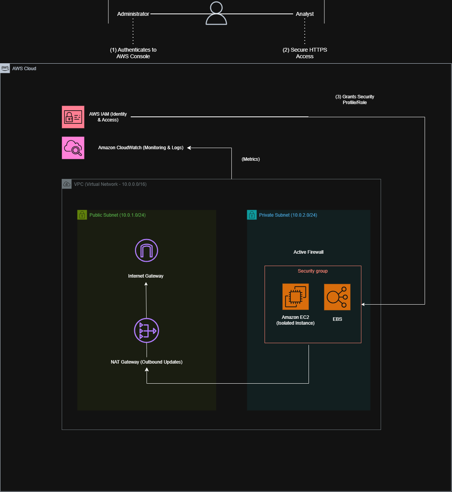

# Secure Amazon EC2 Management Architecture

This repository contains the architectural design and documentation for a secure, resilient, and well-structured infrastructure to manage Amazon EC2 instances on AWS, using isolated network concepts and the principle of least privilege.

---

## 🗺️ Architecture Diagram



---

# 🔒 Security Pillars & Components Breakdown

This architecture follows the **AWS Well-Architected Framework**, with a strong focus on **Security**, **Operational Excellence**, and secure administrative access.

## 1. Network Segregation (VPC)

The environment is deployed inside a **Virtual Private Cloud (VPC)** (`10.0.0.0/16`), divided into two isolated subnets.

### Public Subnet (10.0.1.0/24)

The public subnet hosts the **NAT Gateway**, which provides outbound internet connectivity for resources located in the private subnet.

The VPC is attached to an **Internet Gateway (IGW)**, enabling internet routing for outbound traffic.

No application or database servers are deployed in the public subnet.

### Private Subnet (10.0.2.0/24)

The private subnet hosts the **Amazon EC2** instance.

The instance has **only a private IP address**, making direct inbound connections from the internet impossible.

All outbound traffic (package installation, OS updates, AWS service communication) reaches the internet through the NAT Gateway.

---

## 2. Secure Access & Management (No Public SSH)

Administrative access is performed securely through **AWS Systems Manager Session Manager**, eliminating the need to expose TCP port 22 (SSH) to the internet.

The access flow is:

1. The Administrator authenticates to the AWS Management Console using IAM credentials.
2. Communication between the administrator and AWS services occurs over HTTPS.
3. The EC2 instance, running the **SSM Agent**, establishes an outbound connection to AWS Systems Manager through the NAT Gateway.
4. AWS securely brokers the session between the administrator and the EC2 instance.

Because the communication is initiated from inside the VPC, **no inbound SSH rule is required**.

---

## 3. Protection Layers & Governance

### Security Group

The EC2 instance is protected by a **stateful Security Group**, acting as the primary instance-level firewall.

It blocks unsolicited inbound traffic while allowing only the outbound connections required for system management and updates.

### AWS IAM

An **IAM Role (Instance Profile)** is attached directly to the EC2 instance.

This role provides temporary AWS credentials, allowing the instance to:

- Communicate with AWS Systems Manager
- Publish monitoring metrics to Amazon CloudWatch
- Access AWS services without storing static credentials

This implementation follows the **Principle of Least Privilege**.

### Amazon CloudWatch

Amazon CloudWatch collects operational metrics from the EC2 instance, providing centralized monitoring, observability, and health visibility.

The instance publishes metrics using its attached IAM Role.

### Amazon EBS

An **Amazon Elastic Block Store (EBS)** volume is attached to the EC2 instance.

It provides persistent storage for:

- Ubuntu operating system
- Installed applications
- Configuration files
- Persistent application data

---

# 🚀 Connection Flow

The architecture operates as follows:

### Administration Flow

1. Administrator authenticates to AWS.
2. HTTPS connection is established with AWS Systems Manager.
3. Session Manager securely connects to the EC2 instance through the SSM Agent.
4. No public IP or SSH access is required.

### Outbound Internet Access

When the EC2 instance needs internet access (for example, installing packages or downloading updates), traffic follows this path:

```
EC2
   ↓
Private Route Table
   ↓
NAT Gateway
   ↓
Internet Gateway
   ↓
Internet
```

This design keeps the EC2 instance isolated while still allowing secure outbound connectivity.

---

# 🔮 Future Enhancements

As the environment evolves, the following improvements are planned:

- **High Availability (HA):**
  - Deploy a second private subnet in another Availability Zone.
  - Use an Auto Scaling Group.
  - Place the instances behind an Application Load Balancer (ALB).

- **Enhanced Auditing:**
  - Enable AWS CloudTrail for API auditing.
  - Enable VPC Flow Logs for network traffic analysis and security investigations.

- **Additional Security:**
  - Encrypt EBS volumes using AWS KMS.
  - Store application secrets in AWS Secrets Manager.
  - Implement VPC Endpoints for Systems Manager and CloudWatch to eliminate NAT dependency for AWS service communication.

---

# ✅ Security Highlights

- No public EC2 instance
- No public SSH (Port 22 closed)
- Private subnet isolation
- Least privilege with IAM Roles
- Stateful Security Groups
- Secure administration via AWS Systems Manager
- Centralized monitoring with Amazon CloudWatch
- Persistent encrypted storage with Amazon EBS
- Outbound-only internet connectivity through NAT Gateway
